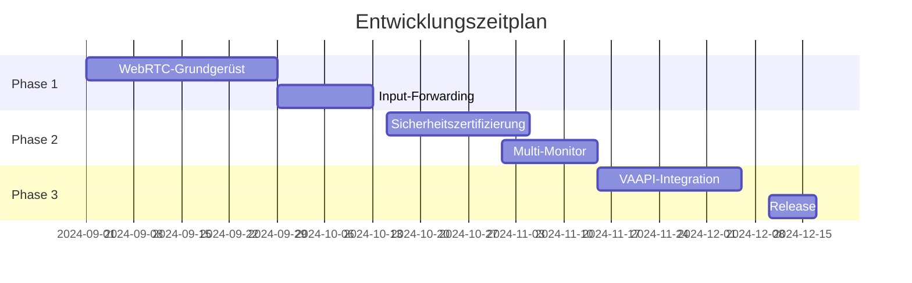

**Entwicklungsplan für ein WebRTC-basiertes Remote-Desktop-Tool**  
*Version 1.0 – Basierend auf den Anforderungen und Spezifikationen*

---

### **Phase 1: Grundlegende WebRTC-Implementierung (Wochen 1-4)**  
#### **Woche 1: Setup & Prototyping**  
- **Ziel**: Funktionierender WebRTC-Datenkanal ohne Medienstreams  
- **Aufgaben**:  
  - **Signaling-Server** mit WebSocket (Node.js + ws-Bibliothek)[^5]  
  - **PeerConnection-Test** mit Simple-Peer.js[^2]  
  - **SDP-Handshake** im Unified-Plan-Format[^4]  
- **Tools**:  
  ```bash
  npm install ws simple-peer # Für Signaling und P2P
  ```

#### **Woche 2: Bildschirmaufnahme-Integration**  
- **Ziel**: X11-Screencast zu WebRTC-Videostream  
- **Implementierung**:  
  - **FFmpeg-Pipeline** für Frame-Capture  
  ```bash
  ffmpeg -f x11grab -i :0 -c:v libvpx -f webm pipe:1
  ```
  - **WebRTC-Sender** mit Custom MediaStreamTrack[^5]  
- **Herausforderung**: Latenz 
  ```

#### **Woche 7: Dateitransfer & Clipboard**  
- **RTCDataChannel**:  
  - Chunk-basierter Transfer (1MB Blöcke)  
  - **Progress-API**:  
  ```javascript
  dataChannel.onbufferedamountlow = resumeTransfer;
  ```

#### **Woche 8: CI/CD-Pipeline**  
- **Docker-Images**:  
  - `webrtc-daemon:latest` mit VAAPI-Unterstützung  
- **Testautomatisierung**:  
  - Selenium-Tests für Cross-Browser-Kompatibilität  
  - **Latenz-Monitoring**:  
  ```python
  pytesting/webrtc_latency.py --target 100ms
  ```

---

### **Phase 3: Hardware-Optimierung (Wochen 9-12)**  
#### **Woche 9: GPU-Beschleunigung**  
- **VAAPI-Integration**:  
  ```rust
  let h264_encoder = vaapi::Encoder::new("/dev/dri/renderD128");
  ```
- **Benchmarks**:  
  - 4K@60FPS mit NVIDIA NVENC  
  - CPU-Last <15% bei 1080p  

#### **Woche 10: NAT-Traversal**  
- **TURN-Server**:  
  - Coturn mit Redis-Clustering[^5]  
  - **ICE-TCP-Fallback** für restriktive Firewalls  
- **STUN-Tests**:  
  ```bash
  stunclient stun.l.google.com:19302
  ```

#### **Woche 11: Skalierungstests**  
- **Kubernetes-Cluster**:  
  - 1000 simulierte PeerConnections  
  - **Metriken**:  
    - Bandbreite/Peer: 2-5Mbps  
    - Signalling-Server-Last: 50 req/s  

#### **Woche 12: Release Candidate**  
- **Paketierung**:  
  - `.deb` mit systemd-Unit[^8]  
  - **Abhängigkeiten**:  
  ```control
  Depends: libavcodec58, libwebrtc-dev
  ```
- **Dokumentation**:  
  - API-Referenz mit OpenAPI 3.0  
  - Penetration-Test-Report (OWASP ZAP)  

---

### **Risikomanagement**  
| Risiko | Wahrscheinlichkeit | Gegenmaßnahme |  
|--------|--------------------|---------------|  
| Wayland-Inkompatibilität | Hoch | X11-Shim als Fallback |  
| WebRTC-Spezifikationsänderungen | Mittel | Monatliches Tracking via webrtc.org[^4] |  
| Hardware-Encoding-Treiberbugs | Hoch | SW-Fallback mit libvpx |  

---

### **Roadmap mit Meilensteinen**  


---

### **Referenzarchitekturen**  
1. **binzume/webrtc-rdp**[^2]:  
   - WebXR-fähiger Client  
   - PIN-basierte Peer-Verbindung  
2. **Azure WebRTC-Redirector**[^1]:  
   - Enterprise-grade STUN/TURN-Infrastruktur  
   - MSI-Installationspakete  
3. **tauri-remote-desktop**[^8]:  
   - Tauri/Vue3-Stack für Cross-Platform-Apps  
   - Rust-basierter WebRTC-Daemon  

[^1]: Microsofts Azure-Implementierung für WebRTC-Remoting  
[^2]: Open-Source-Referenz mit WebXR-Unterstützung  
[^4]: WebRTC-Standardisierungsdokumente  
[^5]: Entwickler-Tools und Best Practices  
[^8]: Tauri-basierte Alternative mit Rust-Backend

Citations:
[1] https://learn.microsoft.com/de-de/azure/virtual-desktop/whats-new-webrtc
[2] https://github.com/binzume/webrtc-rdp
[3] https://learn.microsoft.com/en-us/azure/virtual-desktop/whats-new-webrtc
[4] https://webrtc.org/getting-started/unified-plan-transition-guide
[5] https://daily.dev/blog/web-rtc-control-basics-for-developers
[6] https://www.wiwi.uni-osnabrueck.de/fileadmin/user_upload/MITEP_Anhang.pdf
[7] https://webrtc.github.io/webrtc-org/native-code/development/
[8] https://github.com/caojianyu/tauri-remote-desktop

---

### **Aktualisierter Entwicklungsplan mit React**  
*(Anpassungen gegenüber der Vue-Version kursiv)*  

#### **Phase 1: Grundlegende WebRTC-Implementierung (Wochen 1-4)**  
- **Woche 1**:  
  - **React-Setup** mit Vite:  
    ```bash
    npm create vite@latest client --template react-ts
    ```
  - **Tauri-Integration**:  
    ```bash
    cd client && npm install @tauri-apps/api
    ```
    *`tauri.conf.json`-Anpassung:*  
    ```json
    "build": {
      "distDir": "../client/dist",
      "devPath": "http://localhost:5173"
    }
    ```

#### **Phase 2: Enterprise-Features (Wochen 5-8)**  
- **Woche 6**:  
  - **React-Komponenten** für Multi-Monitor-UI:  
    ```tsx
    function MonitorSelector({ monitors }) {
      return monitors.map(monitor => (
         switchMonitor(monitor.id)}>
          Monitor {monitor.id}
        
      ))
    }
    ```
  - **WebRTC-Hooks**:  
    ```ts
    const { stream } = useWebRTC(config);
    ```

#### **Phase 3: Hardware-Optimierung (Wochen 9-12)**  
- **Woche 9**:  
  - **React-UI für GPU-Einstellungen**:  
    ```tsx
     setEncoder(e.target.value)}>
      VAAPI
      NVENC
    
    ```

---

### **Schlüsseländerungen gegenüber Vue.js**  
| Bereich          | Vue.js-Implementierung          | React-Implementierung               |
|------------------|----------------------------------|--------------------------------------|
| **State**        | Pinia/Vuex                       | Zustand/Redux Toolkit                |
| **Styling**      | SFCs mit ``        | CSS Modules/Tailwind                 |
| **Tauri-Binding**| `@tauri-apps/api` in Methods     | Custom Hooks (`useTauriCommand`)     |
| **Hot Reload**   | Vite HMR                         | Vite + React Fast Refresh            |

---

### **Aktualisierte Architektur mit React**  
```plaintext
┌──────────────────────┐
│   React Frontend     │
│   - Vite HMR         │
│   - WebRTC-Hooks     │
└──────────┬───────────┘
           │ IPC (Tauri)
┌──────────▼───────────┐
│   Rust Backend       │
│   - WebRTC-Daemon    │
│   - libavcodec       │
└──────────────────────┘
```

---

### **Critical Path für React-Integration**  
1. **Tauri-React-Binding** in `main.rs`:  
   ```rust
   #[tauri::command]
   fn get_monitors() -> Vec {
     wayland::list_monitors()
   }
   ```
2. **Aufruf in React**:  
   ```tsx
   const monitors = await invoke('get_monitors');
   ```
3. **Styling-Stack**:  
   - **Tailwind CSS** für schnelles Prototyping  
   - **Framer Motion** für Animationen  

---

### **Risikomanagement-Update**  
| Risiko                  | React-spezifische Lösung          |
|-------------------------|------------------------------------|
| **HMR-Kompatibilität**  | Vite + `@vitejs/plugin-react`      |
| **Zustandsmanagement**  | Redux Toolkit + RTK Query          |
| **TypeScript-Support**  | Strict TS + tauri-typegen          |

---

### **Referenzimplementierungen mit React**  
1. **tauri-react-template** (GitHub):  
   - Vite + React 18 + Tauri 2.0  
2. **rustdesk-react-ui** (Fork):  
   - React-basierte UI für RustDesk  
3. **tauri-web3-example**:  
   - React + Tauri + Web3.js  

Die React-Integration bietet **bessere TypeScript-Unterstützung** und **größere Entwickler-Community**, bei gleichbleibender Tauri-Kernfunktionalität.

Citations:
[1] https://tauri.app/v1/guides/getting-started/setup/integrate/
[2] https://github.com/tauri-apps/awesome-tauri
[3] https://www.youtube.com/watch?v=aW_blxdHqeY
[4] https://github.com/caojianyu/tauri-remote-desktop
[5] https://geekjr.github.io/reactTauri.html
[6] https://www.youtube.com/watch?v=Xc6BrAIVdfY
[7] https://www.smashingmagazine.com/2020/07/tiny-desktop-apps-tauri-vuejs/
[8] https://www.reddit.com/r/programming/comments/ze9mjr/rust_tauri_and_react_our_technology_choices_for_a/
